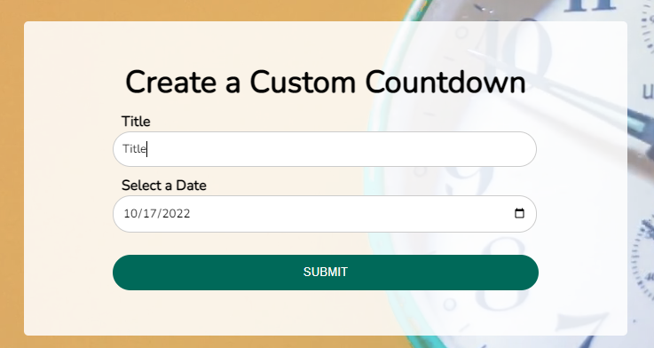

# Custom Countdown Clone Project

## 1. Project Description 😆

Build a clone of a Custom Countdown using HTML, CSS and Javascript.
This is a small project about custom countdown.

## 2. Tech Stack 😎

1. >HTML
2. >CSS
3. >Javascript

## 3. Installing 😉

```link
https://github.com/VoDuyThienVinh/CustomCountdown
```

1. Clone the repo [Custom Countdown](https://github.com/VoDuyThienVinh/CustomCountdown)
2. Open project folder
3. Explore
4. Open index.html in Visual Studio Code, using Live Server
5. Enjoy 😍

## 4. Screenshots 😂



## 5. Link Github-Page 😁

```link
https://voduythienvinh.github.io/CustomCountdown/
```

## 6. Resource Information

[Video Compression Tool](https://www.youcompress.com/)

[Pixabay Stocks Video](https://pixabay.com/videos/)

[Google Fonts](https://fonts.google.com/)

[Mozilla - Form Accessibility](https://developer.mozilla.org/en-US/docs/Web/Accessibility/ARIA)

[W3Schools - String Split](https://www.w3schools.com/jsref/jsref_split.asp)

[Mozilla - Date Input](https://developer.mozilla.org/en-US/docs/Web/HTML/Element/input/date)

[W3Schools - Date Object](https://www.w3schools.com/jsref/jsref_obj_date.asp)

[Mozilla - Date toISOString](https://developer.mozilla.org/en-US/docs/Web/JavaScript/Reference/Global_Objects/Date/toISOString)

[Mozilla - Submit Event](https://developer.mozilla.org/en-US/docs/Web/API/HTMLFormElement/submit_event)

[W3Schools - Prevent Default](https://www.w3schools.com/jsref/event_preventdefault.asp)

[W3Schools - JS Timing Events](https://www.w3schools.com/js/js_timing.asp)

[Mozilla - JSON Stringify](https://developer.mozilla.org/en-US/docs/Web/JavaScript/Reference/Global_Objects/JSON/stringify)

[Mozilla - JSON Parse](https://developer.mozilla.org/en-US/docs/Web/JavaScript/Reference/Global_Objects/JSON/parse)

## Adapted From: 😉

Udemy Course: JavaScript Web Projects: 20 Projects to Build Your Portfolio
Project Name: Custom Countdown
Create by: Andrei Neagoie, Jacinto Wong, Zero To Mastery
Last updated 8/2022
URL: <https://www.udemy.com/course/javascript-web-projects-to-build-your-portfolio-resume/>
